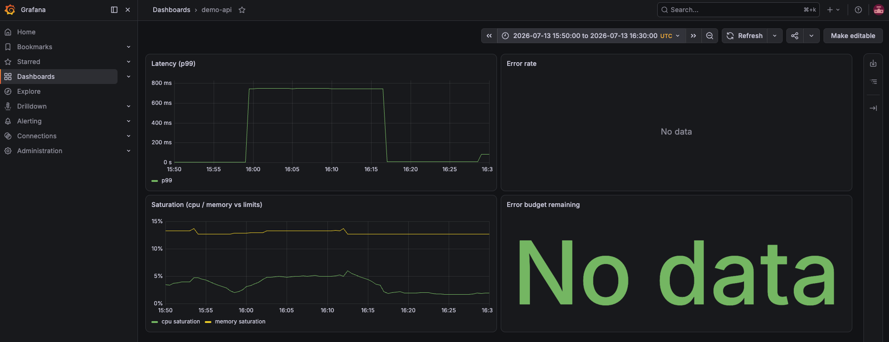

# Platform Zero

A reference internal developer platform. One manifest per service; everything else
is generated. Deploys go through GitOps. Correctness is judged by SLOs, not by
whether the config files happen to be valid.

**Stack:** Kubernetes · ArgoCD · Helm · Terraform · GitHub Actions · Prometheus · Grafana · Python

---

## The question

Most internal platforms optimize for making deployments easy. This one asks a
harder question: **if CI says a deployment is valid, how do we know it's correct?**

To find out, I deployed a configuration that violated its own latency objective.
Every validation gate passed. The service failed anyway. Only the generated SLO
alert caught it.

That result is the thesis of the whole project:

> **Static validation proves a deployment is well-formed. Only production, measured
> against a declared objective, proves it is correct.**

---

## The golden path

A developer ships a new service without writing a line of Kubernetes:

```console
$ platformctl init payments-api --owner platform-team --tier 2
scaffolded services/payments-api/service.yaml

$ platformctl validate payments-api
PASS payments-api

$ platformctl render payments-api
rendered observability
rendered payments-api

$ platformctl render --check
OK observability
OK demo-api
OK payments-api

$ platformctl status demo-api
OK demo-api: sync=Synced health=Healthy image=v0.1.0 alerts=none
```

Edit `services/payments-api/service.yaml`, commit, push. On merge, ArgoCD deploys
the service, Prometheus scrapes it, Grafana gets a dashboard, and an SLO alert
exists — all derived from that one manifest. Nobody files a monitoring ticket.
Nobody writes a dashboard.

---

## The incident

One environment variable changed:

```diff
- LATENCY_MS: "0"
+ LATENCY_MS: "600"     # the service's declared SLO is latency_p99_ms: 500
```

The manifest was self-contradictory: it promised 500ms and configured 600ms. It
passed contract validation, drift detection, `promtool`, `kubeconform`, and all 117
unit tests — because the configuration was *well-formed*. It was just wrong.

ArgoCD reported `Synced / Healthy` throughout. `platformctl status` reported
`image=v0.1.0` throughout, correctly — the image never changed, only config did.
Three systems all reporting "fine" while the service ran at 748ms p99, 150x over
its baseline.

**The only thing that caught it was `DemoApiLatencyP99High` — an alert generated
from `slo.latency_p99_ms: 500` in the same manifest that contained the bad value.**



Rollback was a `git revert`. Re-rendering produced zero diff: because rendering is
pure and byte-deterministic, reverting the one hand-written file restored all four
derived artifacts exactly. No manual repair, no `kubectl`.

Full writeup: [`docs/incidents/2026-07-13-demo-api-latency-slo-breach.md`](docs/incidents/2026-07-13-demo-api-latency-slo-breach.md)

---

## The service contract

Every service is declared once, in `services/<name>/service.yaml`. Every field is
required — an optional field becomes an unset field, and an unset field becomes the
3am page with no owner.

| Declared | Enforced by |
|---|---|
| Owning team, tier | `platformctl validate` — team must exist in `platform/teams.yaml` |
| Immutable image tag | `latest` and unpinned tags rejected |
| Resource requests + limits | Limits must be ≥ requests |
| Readiness + liveness probes | Schema-required, rendered into the Deployment |
| SLO (availability, p99 latency, window) | Generates the recording rules and burn-rate alerts |
| Runbook path | Validation fails if the referenced file doesn't exist |
| Rollback strategy | `gitops-revert` only |

From that one file, the platform generates four artifacts — Helm values, an ArgoCD
Application, Prometheus rules, and a Grafana dashboard. None are hand-written, and
CI regenerates all of them and fails on drift. Delete a manifest and its orphaned
artifacts are detected too.

Details: [`docs/service-contract.md`](docs/service-contract.md)

---

## Two CI checks that are actual oracles

The golden fixtures are generated by the code they test, which makes them a
regression lock, not an oracle — they cannot catch a bug that was already present
when they were generated.

This isn't theoretical. An invalid-Prometheus-identifier bug (`demo-api:sli_...` —
hyphens are illegal in metric names) passed the entire test suite and was caught
only by the Prometheus Operator's admission webhook at sync time.

So CI now validates rendered output against the upstream parsers themselves:
`promtool` for the Prometheus rules, `kubeconform` for the Kubernetes manifests
(including the ArgoCD and Prometheus Operator CRDs). Both pins are deliberate —
`promtool` is held at 2.55.1 because 3.x accepts UTF-8 metric names that the
Operator's webhook rejects, which makes the *newer* version the *worse* oracle.

I verified both by reintroducing the bug and confirming CI went red.

---

## What runs, and what doesn't

**Actually runs:** kind cluster, ArgoCD, Helm, Prometheus, Grafana, GitHub Actions,
and `platformctl`. The GitOps loop, the SLO alert, the failure injection, and the
rollback all genuinely execute. The incident above happened on this platform, and
the screenshot is from its own generated dashboard.

**Reference IaC, validated but never applied:** the Terraform for VPC, EKS, IAM, and
RDS. It passes `terraform validate` and `fmt -check` in CI. It shows the production
topology this platform is designed to sit on, without claiming cloud infrastructure
I never stood up.

Setup: [`docs/local-setup.md`](docs/local-setup.md) — clean laptop to running
platform.

---

## Repository

```
services/<name>/service.yaml     the only hand-written file per service
src/platformctl/                 the CLI: init, validate, render, status
helm/service/                    the one shared chart every service uses
argocd/                          app-of-apps + generated Applications
observability/                   generated rules + dashboards, wrapped for the cluster
terraform/                       reference IaC (validated, not applied)
platform/                        teams.yaml, config.yaml
examples/demo-api/               the reference service
.github/workflows/               CI: validate → render --check → promtool → kubeconform → tests
docs/                            philosophy, contract, runbooks, incidents
```

---

## Why it's built this way

[`docs/platform-philosophy.md`](docs/platform-philosophy.md) makes the argument in
full, including what this platform deliberately does *not* do — no service mesh, no
CRDs, no multi-cluster. At 20–50 engineers, most platform complexity is premature.

The short version: standards that aren't enforced are preferences, observability
that must be requested won't exist, and a platform's only real customer is the
engineer trying to ship.
